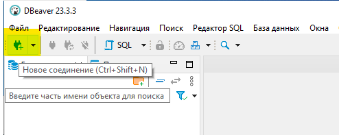
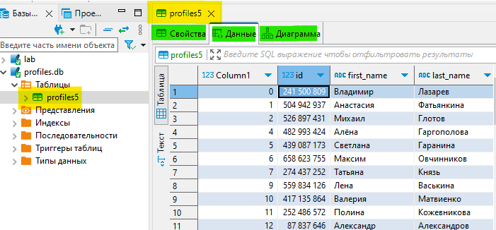
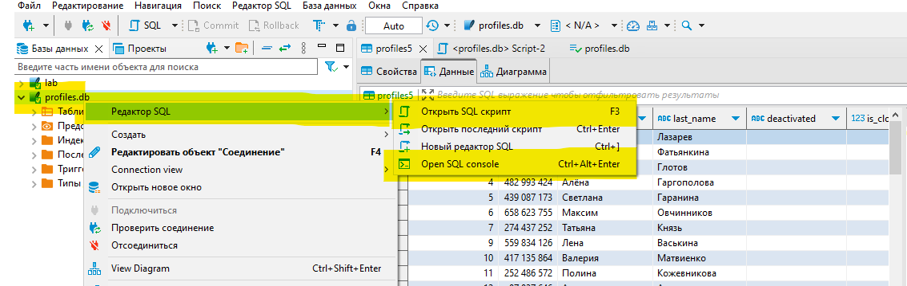

# DBeaver
Это универсальное клиентское приложения для работы с СУБД.

**Настройка размера шрифта**\
Window > Preferences > User Interface > Appearance > Colors and Fonts > DBeaver Fonts > Main font\
Окна > Настройки > Интерфейс пользователя > Вид > Цвета и шрифты > DBeaver шрифты > Основной шрифт

**Подключение (открытие) БД SQLite**

1. На панели инструментов: Новое соединение \

2. Выбрать тип СУБД - SQLite, далее>
3. Указать путь к существующему файлу БД или создать новый, 
    - [Тест соединения] (скачать необходимый драйвер для работы с СУБД, если необходимо)
    - [Готово]

**Импорт данных из файлов (например csv) в БД**\
ПКМ на БД > Import (импорт) > Выбор файла, настройка импорта, просмотр таблицы, [готово]

**Просмотр данных**
Для просмотра содержимого таблицы на панели подключений (справа) выберете раздел Таблицы (Tables) вашей БД.

В DBeaver таблица может быть показана в тремя способами (выделены зелёным):
* Свойства - SQL описание таблицы (названия полей, их типы, ограничения и т.п.)
* Данные
* Диаграмма - представление таблицы в виде логическогой диаграммы, с указанием названия и перечня полей.

**Выполнение SQL**
ПКМ на подключении > 
* Открыть SQL скрипт (Open SQL Script)\
  В этом режиме удобно выполнять несколько SQL операторов за один раз)\
или
* Open SQL Console\
  Режим хорошо подходит для выполнения одиночных операторов.

<kbd>Ctrl</kbd> + <kbd>Enter</kbd> — выполнить операцию, записанную в текущей строке.

<kbd>Alt</kbd> + <kbd>X</kbd> — выполнить скрипт целиком.

Если при выполнении скрипта целиком предполагается получении нескольких таблиц (например в скрипте записаны два отдельных оператора select), то результаты будут показаны в нижней части окна DBeaver в отдельных вкладках.

## См. также
- SQLite
