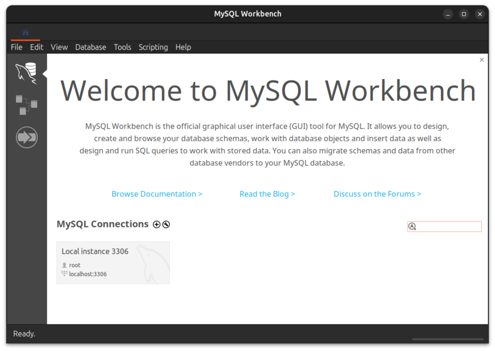
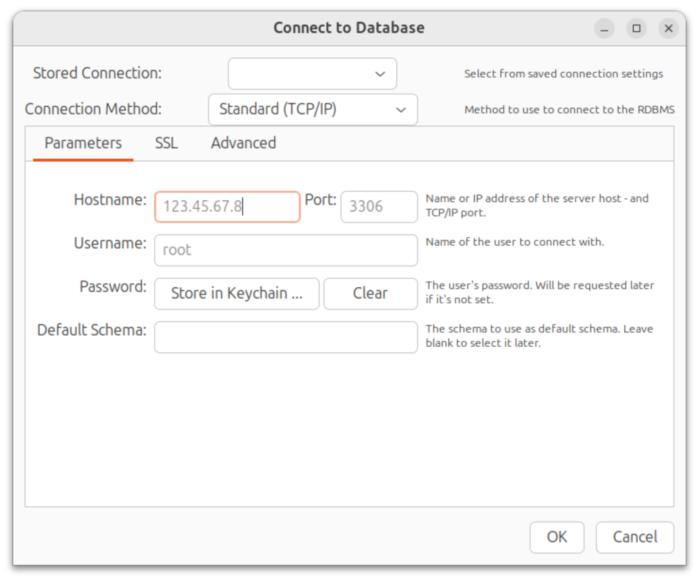
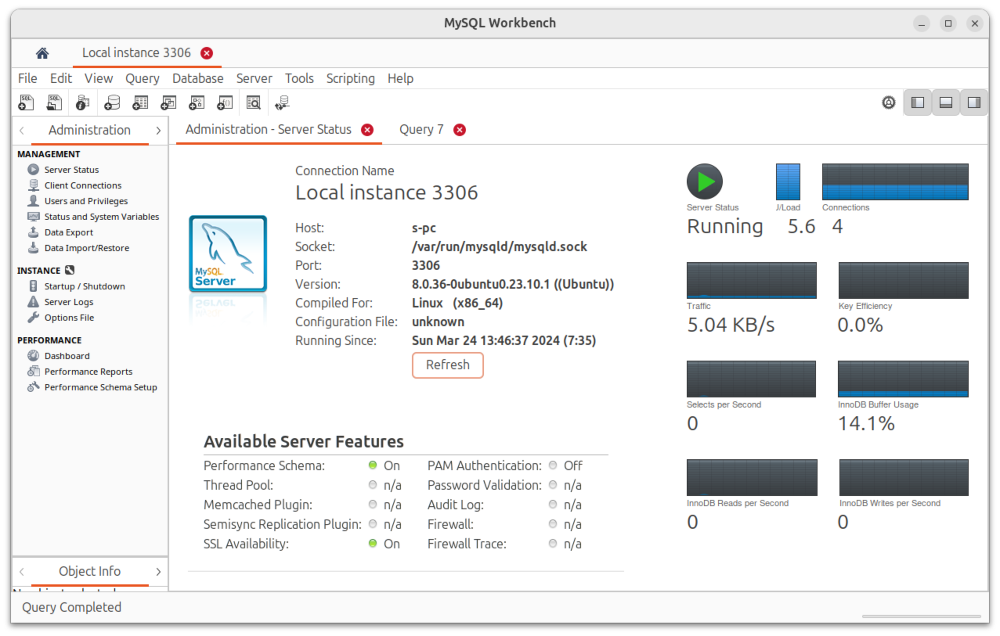
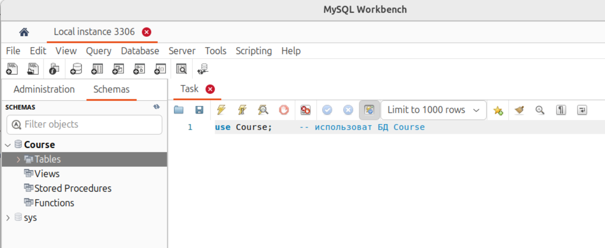

# Workbench

**Подключение к локальному серверу**
Если сервер MySQL запущен на том же хосте, что и Workbench то на приветсвенном экране будет показан адрес сервера (раздел MySQL Connections)

Кликните на сервере для подключения.\
Появится окно для ввода пароля, введите его.\
Откроется основное окно Workbench для работы с сервером:

**Подключение к удалённому серверу**
Меню Database > Connect to database (<kbd>Ctrl</kbd>+<kbd>U</kbd>).\
Необходимо задать:
- Hostname — IP адрес или имя сервера;
- Port — порт, если не по умолчанию;
- Username — имя пользователя;
- Password — пароль.

**Основное окно**

В левой части окна (**Administration**) находятся панели управления (Managment, Instance, Performance). 

В первой влкладке 
(**Administration - Server Ststus**) открыт раздел Server Status. Он показывает основные сведения о работе сервера, к которому сейчас открыто соединение.\

Вторая вкладка **Query 7** — окно запросов. В нём записываются SQL запросы 

**Базы данных и окно запросов**
Раздел **Schemas** (левая часть окна) показывает существующие БД, их таблицы, представления и т.д. На рис. ниже видна БД `Course`.

